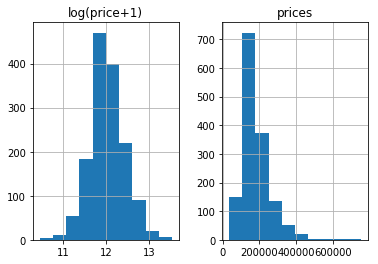
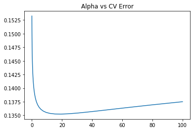
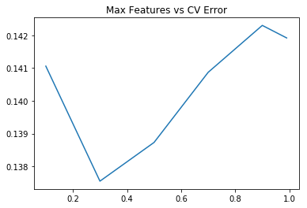

# 房价预测

### 1.查看数据

一般来说源数据的index那一栏没什么用，我们可以用来作为我们pandas dataframe的index。
Kaggle上默认把数据放在input文件夹下，这里为了方便我将数据放在代码目录下。


```python
import numpy as np
import pandas as pd
#Kaggle
#train_df = pd.read_csv('../input/train.csv', index_col=0)

train_df = pd.read_csv('train.csv', index_col=0)
test_df = pd.read_csv('test.csv', index_col=0)
train_df.head()
```


<div>
<style>
    .dataframe thead tr:only-child th {
        text-align: right;
    }

    .dataframe thead th {
        text-align: left;
    }

    .dataframe tbody tr th {
        vertical-align: top;
    }
</style>
<table border="1" class="dataframe">
  <thead>
    <tr style="text-align: right;">
      <th></th>
      <th>MSSubClass</th>
      <th>MSZoning</th>
      <th>LotFrontage</th>
      <th>LotArea</th>
      <th>Street</th>
      <th>Alley</th>
      <th>LotShape</th>
      <th>LandContour</th>
      <th>Utilities</th>
      <th>LotConfig</th>
      <th>...</th>
      <th>PoolArea</th>
      <th>PoolQC</th>
      <th>Fence</th>
      <th>MiscFeature</th>
      <th>MiscVal</th>
      <th>MoSold</th>
      <th>YrSold</th>
      <th>SaleType</th>
      <th>SaleCondition</th>
      <th>SalePrice</th>
    </tr>
    <tr>
      <th>Id</th>
      <th></th>
      <th></th>
      <th></th>
      <th></th>
      <th></th>
      <th></th>
      <th></th>
      <th></th>
      <th></th>
      <th></th>
      <th></th>
      <th></th>
      <th></th>
      <th></th>
      <th></th>
      <th></th>
      <th></th>
      <th></th>
      <th></th>
      <th></th>
      <th></th>
    </tr>
  </thead>
  <tbody>
    <tr>
      <th>1</th>
      <td>60</td>
      <td>RL</td>
      <td>65.0</td>
      <td>8450</td>
      <td>Pave</td>
      <td>NaN</td>
      <td>Reg</td>
      <td>Lvl</td>
      <td>AllPub</td>
      <td>Inside</td>
      <td>...</td>
      <td>0</td>
      <td>NaN</td>
      <td>NaN</td>
      <td>NaN</td>
      <td>0</td>
      <td>2</td>
      <td>2008</td>
      <td>WD</td>
      <td>Normal</td>
      <td>208500</td>
    </tr>
    <tr>
      <th>2</th>
      <td>20</td>
      <td>RL</td>
      <td>80.0</td>
      <td>9600</td>
      <td>Pave</td>
      <td>NaN</td>
      <td>Reg</td>
      <td>Lvl</td>
      <td>AllPub</td>
      <td>FR2</td>
      <td>...</td>
      <td>0</td>
      <td>NaN</td>
      <td>NaN</td>
      <td>NaN</td>
      <td>0</td>
      <td>5</td>
      <td>2007</td>
      <td>WD</td>
      <td>Normal</td>
      <td>181500</td>
    </tr>
    <tr>
      <th>3</th>
      <td>60</td>
      <td>RL</td>
      <td>68.0</td>
      <td>11250</td>
      <td>Pave</td>
      <td>NaN</td>
      <td>IR1</td>
      <td>Lvl</td>
      <td>AllPub</td>
      <td>Inside</td>
      <td>...</td>
      <td>0</td>
      <td>NaN</td>
      <td>NaN</td>
      <td>NaN</td>
      <td>0</td>
      <td>9</td>
      <td>2008</td>
      <td>WD</td>
      <td>Normal</td>
      <td>223500</td>
    </tr>
    <tr>
      <th>4</th>
      <td>70</td>
      <td>RL</td>
      <td>60.0</td>
      <td>9550</td>
      <td>Pave</td>
      <td>NaN</td>
      <td>IR1</td>
      <td>Lvl</td>
      <td>AllPub</td>
      <td>Corner</td>
      <td>...</td>
      <td>0</td>
      <td>NaN</td>
      <td>NaN</td>
      <td>NaN</td>
      <td>0</td>
      <td>2</td>
      <td>2006</td>
      <td>WD</td>
      <td>Abnorml</td>
      <td>140000</td>
    </tr>
    <tr>
      <th>5</th>
      <td>60</td>
      <td>RL</td>
      <td>84.0</td>
      <td>14260</td>
      <td>Pave</td>
      <td>NaN</td>
      <td>IR1</td>
      <td>Lvl</td>
      <td>AllPub</td>
      <td>FR2</td>
      <td>...</td>
      <td>0</td>
      <td>NaN</td>
      <td>NaN</td>
      <td>NaN</td>
      <td>0</td>
      <td>12</td>
      <td>2008</td>
      <td>WD</td>
      <td>Normal</td>
      <td>250000</td>
    </tr>
  </tbody>
</table>
<p>5 rows × 80 columns</p>
</div>


### 2.合并数据

将数据进行合并方便处理，SalePrice作为训练目标，只会出现在训练集中，不会在测试集中，所以把SalePrice这一列给拿出来


```python
%matplotlib inline
prices = pd.DataFrame({"prices": train_df["SalePrice"], "log(price+1)": np.log1p(train_df["SalePrice"])})
prices.hist()
```


    array([[<matplotlib.axes._subplots.AxesSubplot object at 0x000002A55CEDC4A8>,
            <matplotlib.axes._subplots.AxesSubplot object at 0x000002A55D7F7198>]], dtype=object)





label本身并不平滑,使用最log1p, 也就是 log(x+1)把label给“平滑化”（正态化）,使我们的结果更加准确。最后算结果的时候，要记得把预测到的平滑数据给变回去，log1p()就需要expm1(); 同理，log()就需要exp().


```python
y_train = np.log1p(train_df.pop('SalePrice'))
all_df = pd.concat((train_df, test_df),axis=0)
all_df.shape
```


    (2919, 79)


```python
y_train.head()
```


    Id
    1    12.247699
    2    12.109016
    3    12.317171
    4    11.849405
    5    12.429220
    Name: SalePrice, dtype: float64


### 3.变量转化

#### 变量属性转化

MSSubClass 的值其实应该是一个category，使用DF的时候，这类数字符号会被默认记成数字。这种东西就很有误导性，我们需要把它变回成string


```python
all_df['MSSubClass'].dtypes
```


    dtype('int64')


```python
all_df['MSSubClass'] = all_df['MSSubClass'].astype(str)
```


```python
all_df['MSSubClass'].value_counts()
```


    20     1079
    60      575
    50      287
    120     182
    30      139
    70      128
    160     128
    80      118
    90      109
    190      61
    85       48
    75       23
    45       18
    180      17
    40        6
    150       1
    Name: MSSubClass, dtype: int64


#### 把category的变量转变成numerical表达形式

当我们用numerical来表达categorical的时候，要注意，数字本身有大小的含义，所以乱用数字会给之后的模型学习带来麻烦。于是我们可以用One-Hot的方法来表达category。


```python
pd.get_dummies(all_df['MSSubClass'], prefix='MSSubClass').head()
```


<div>
<style>
    .dataframe thead tr:only-child th {
        text-align: right;
    }

    .dataframe thead th {
        text-align: left;
    }

    .dataframe tbody tr th {
        vertical-align: top;
    }
</style>
<table border="1" class="dataframe">
  <thead>
    <tr style="text-align: right;">
      <th></th>
      <th>MSSubClass_120</th>
      <th>MSSubClass_150</th>
      <th>MSSubClass_160</th>
      <th>MSSubClass_180</th>
      <th>MSSubClass_190</th>
      <th>MSSubClass_20</th>
      <th>MSSubClass_30</th>
      <th>MSSubClass_40</th>
      <th>MSSubClass_45</th>
      <th>MSSubClass_50</th>
      <th>MSSubClass_60</th>
      <th>MSSubClass_70</th>
      <th>MSSubClass_75</th>
      <th>MSSubClass_80</th>
      <th>MSSubClass_85</th>
      <th>MSSubClass_90</th>
    </tr>
    <tr>
      <th>Id</th>
      <th></th>
      <th></th>
      <th></th>
      <th></th>
      <th></th>
      <th></th>
      <th></th>
      <th></th>
      <th></th>
      <th></th>
      <th></th>
      <th></th>
      <th></th>
      <th></th>
      <th></th>
      <th></th>
    </tr>
  </thead>
  <tbody>
    <tr>
      <th>1</th>
      <td>0</td>
      <td>0</td>
      <td>0</td>
      <td>0</td>
      <td>0</td>
      <td>0</td>
      <td>0</td>
      <td>0</td>
      <td>0</td>
      <td>0</td>
      <td>1</td>
      <td>0</td>
      <td>0</td>
      <td>0</td>
      <td>0</td>
      <td>0</td>
    </tr>
    <tr>
      <th>2</th>
      <td>0</td>
      <td>0</td>
      <td>0</td>
      <td>0</td>
      <td>0</td>
      <td>1</td>
      <td>0</td>
      <td>0</td>
      <td>0</td>
      <td>0</td>
      <td>0</td>
      <td>0</td>
      <td>0</td>
      <td>0</td>
      <td>0</td>
      <td>0</td>
    </tr>
    <tr>
      <th>3</th>
      <td>0</td>
      <td>0</td>
      <td>0</td>
      <td>0</td>
      <td>0</td>
      <td>0</td>
      <td>0</td>
      <td>0</td>
      <td>0</td>
      <td>0</td>
      <td>1</td>
      <td>0</td>
      <td>0</td>
      <td>0</td>
      <td>0</td>
      <td>0</td>
    </tr>
    <tr>
      <th>4</th>
      <td>0</td>
      <td>0</td>
      <td>0</td>
      <td>0</td>
      <td>0</td>
      <td>0</td>
      <td>0</td>
      <td>0</td>
      <td>0</td>
      <td>0</td>
      <td>0</td>
      <td>1</td>
      <td>0</td>
      <td>0</td>
      <td>0</td>
      <td>0</td>
    </tr>
    <tr>
      <th>5</th>
      <td>0</td>
      <td>0</td>
      <td>0</td>
      <td>0</td>
      <td>0</td>
      <td>0</td>
      <td>0</td>
      <td>0</td>
      <td>0</td>
      <td>0</td>
      <td>1</td>
      <td>0</td>
      <td>0</td>
      <td>0</td>
      <td>0</td>
      <td>0</td>
    </tr>
  </tbody>
</table>
</div>


此刻MSSubClass被分成了12个column，每一个代表一个category。是就是1，不是就是0。同理，我们把所有的category数据，都给One-Hot了


```python
all_dummy_df = pd.get_dummies(all_df)
all_dummy_df.head()
```


<div>
<style>
    .dataframe thead tr:only-child th {
        text-align: right;
    }

    .dataframe thead th {
        text-align: left;
    }

    .dataframe tbody tr th {
        vertical-align: top;
    }
</style>
<table border="1" class="dataframe">
  <thead>
    <tr style="text-align: right;">
      <th></th>
      <th>LotFrontage</th>
      <th>LotArea</th>
      <th>OverallQual</th>
      <th>OverallCond</th>
      <th>YearBuilt</th>
      <th>YearRemodAdd</th>
      <th>MasVnrArea</th>
      <th>BsmtFinSF1</th>
      <th>BsmtFinSF2</th>
      <th>BsmtUnfSF</th>
      <th>...</th>
      <th>SaleType_ConLw</th>
      <th>SaleType_New</th>
      <th>SaleType_Oth</th>
      <th>SaleType_WD</th>
      <th>SaleCondition_Abnorml</th>
      <th>SaleCondition_AdjLand</th>
      <th>SaleCondition_Alloca</th>
      <th>SaleCondition_Family</th>
      <th>SaleCondition_Normal</th>
      <th>SaleCondition_Partial</th>
    </tr>
    <tr>
      <th>Id</th>
      <th></th>
      <th></th>
      <th></th>
      <th></th>
      <th></th>
      <th></th>
      <th></th>
      <th></th>
      <th></th>
      <th></th>
      <th></th>
      <th></th>
      <th></th>
      <th></th>
      <th></th>
      <th></th>
      <th></th>
      <th></th>
      <th></th>
      <th></th>
      <th></th>
    </tr>
  </thead>
  <tbody>
    <tr>
      <th>1</th>
      <td>65.0</td>
      <td>8450</td>
      <td>7</td>
      <td>5</td>
      <td>2003</td>
      <td>2003</td>
      <td>196.0</td>
      <td>706.0</td>
      <td>0.0</td>
      <td>150.0</td>
      <td>...</td>
      <td>0</td>
      <td>0</td>
      <td>0</td>
      <td>1</td>
      <td>0</td>
      <td>0</td>
      <td>0</td>
      <td>0</td>
      <td>1</td>
      <td>0</td>
    </tr>
    <tr>
      <th>2</th>
      <td>80.0</td>
      <td>9600</td>
      <td>6</td>
      <td>8</td>
      <td>1976</td>
      <td>1976</td>
      <td>0.0</td>
      <td>978.0</td>
      <td>0.0</td>
      <td>284.0</td>
      <td>...</td>
      <td>0</td>
      <td>0</td>
      <td>0</td>
      <td>1</td>
      <td>0</td>
      <td>0</td>
      <td>0</td>
      <td>0</td>
      <td>1</td>
      <td>0</td>
    </tr>
    <tr>
      <th>3</th>
      <td>68.0</td>
      <td>11250</td>
      <td>7</td>
      <td>5</td>
      <td>2001</td>
      <td>2002</td>
      <td>162.0</td>
      <td>486.0</td>
      <td>0.0</td>
      <td>434.0</td>
      <td>...</td>
      <td>0</td>
      <td>0</td>
      <td>0</td>
      <td>1</td>
      <td>0</td>
      <td>0</td>
      <td>0</td>
      <td>0</td>
      <td>1</td>
      <td>0</td>
    </tr>
    <tr>
      <th>4</th>
      <td>60.0</td>
      <td>9550</td>
      <td>7</td>
      <td>5</td>
      <td>1915</td>
      <td>1970</td>
      <td>0.0</td>
      <td>216.0</td>
      <td>0.0</td>
      <td>540.0</td>
      <td>...</td>
      <td>0</td>
      <td>0</td>
      <td>0</td>
      <td>1</td>
      <td>1</td>
      <td>0</td>
      <td>0</td>
      <td>0</td>
      <td>0</td>
      <td>0</td>
    </tr>
    <tr>
      <th>5</th>
      <td>84.0</td>
      <td>14260</td>
      <td>8</td>
      <td>5</td>
      <td>2000</td>
      <td>2000</td>
      <td>350.0</td>
      <td>655.0</td>
      <td>0.0</td>
      <td>490.0</td>
      <td>...</td>
      <td>0</td>
      <td>0</td>
      <td>0</td>
      <td>1</td>
      <td>0</td>
      <td>0</td>
      <td>0</td>
      <td>0</td>
      <td>1</td>
      <td>0</td>
    </tr>
  </tbody>
</table>
<p>5 rows × 303 columns</p>
</div>


#### 处理好numerical变量

例如，有一些数据是缺失的


```python
all_dummy_df.isnull().sum().sort_values(ascending=False).head(10)
```


    LotFrontage     486
    GarageYrBlt     159
    MasVnrArea       23
    BsmtHalfBath      2
    BsmtFullBath      2
    BsmtFinSF2        1
    GarageCars        1
    TotalBsmtSF       1
    BsmtUnfSF         1
    GarageArea        1
    dtype: int64


处理这些缺失的信息，得好好审题。一般来说，数据集的描述里会写的很清楚，这些缺失都代表着什么。当然，如果实在没有的话，也只能靠自己的想。
在这里，我们用平均值来填满这些空缺。


```python
mean_cols = all_dummy_df.mean()
mean_cols.head(10)
```


    LotFrontage        69.305795
    LotArea         10168.114080
    OverallQual         6.089072
    OverallCond         5.564577
    YearBuilt        1971.312778
    YearRemodAdd     1984.264474
    MasVnrArea        102.201312
    BsmtFinSF1        441.423235
    BsmtFinSF2         49.582248
    BsmtUnfSF         560.772104
    dtype: float64


```python
all_dummy_df = all_dummy_df.fillna(mean_cols)
```


```python
all_dummy_df.isnull().sum().sum()
```


    0


#### 标准化numerical数据

这一步并不是必要，但是得看你想要用的分类器是什么。一般来说，regression的分类器都比较傲娇，最好是把源数据给放在一个标准分布内。不要让数据间的差距太大。
这里，我们当然不需要把One-Hot的那些0/1数据给标准化。我们的目标应该是那些本来就是numerical的数据：


```python
numeric_cols = all_df.columns[all_df.dtypes != 'object']
numeric_cols
```


    Index(['LotFrontage', 'LotArea', 'OverallQual', 'OverallCond', 'YearBuilt',
           'YearRemodAdd', 'MasVnrArea', 'BsmtFinSF1', 'BsmtFinSF2', 'BsmtUnfSF',
           'TotalBsmtSF', '1stFlrSF', '2ndFlrSF', 'LowQualFinSF', 'GrLivArea',
           'BsmtFullBath', 'BsmtHalfBath', 'FullBath', 'HalfBath', 'BedroomAbvGr',
           'KitchenAbvGr', 'TotRmsAbvGrd', 'Fireplaces', 'GarageYrBlt',
           'GarageCars', 'GarageArea', 'WoodDeckSF', 'OpenPorchSF',
           'EnclosedPorch', '3SsnPorch', 'ScreenPorch', 'PoolArea', 'MiscVal',
           'MoSold', 'YrSold'],
          dtype='object')


计算标准分布：(X-X')/s，让我们的数据点更平滑，更便于计算。我们这里也是可以继续使用Log


```python
numeric_col_means = all_dummy_df.loc[:, numeric_cols].mean()
numeric_col_std = all_dummy_df.loc[:, numeric_cols].std()
all_dummy_df.loc[:, numeric_cols] = (all_dummy_df.loc[:, numeric_cols] - numeric_col_means) / numeric_col_std
```

### 4.建立模型

#### 把数据集分回 训练/测试集


```python
dummy_train_df = all_dummy_df.loc[train_df.index]
dummy_test_df = all_dummy_df.loc[test_df.index]
dummy_train_df.shape, dummy_test_df.shape
```


    ((1460, 303), (1459, 303))


#### Ridge Regression

用Ridge Regression模型来跑一遍看看。


```python
from sklearn.linear_model import Ridge
from sklearn.model_selection import cross_val_score
```

把DF转化成Numpy Array，这跟Sklearn更加配


```python
X_train = dummy_train_df.values
X_test = dummy_test_df.values
```

用Sklearn自带的cross validation方法来测试模型


```python
alphas = np.logspace(-3, 2, 50)
test_scores = []
for alpha in alphas:
    clf = Ridge(alpha)
    test_score = np.sqrt(-cross_val_score(clf, X_train, y_train, cv=10, scoring='neg_mean_squared_error'))
    test_scores.append(np.mean(test_score))
```

存下所有的CV值，看看哪个alpha值更好（也就是『调参数』）


```python
import matplotlib.pyplot as plt
%matplotlib inline
plt.plot(alphas, test_scores)
plt.title("Alpha vs CV Error");
```





可见，大概alpha=10~20的时候，可以把score达到0.135左右。

#### Random Forest


```python
from sklearn.ensemble import RandomForestRegressor

max_features = [.1, .3, .5, .7, .9, .99]
test_scores = []
for max_feat in max_features:
    clf = RandomForestRegressor(n_estimators=200, max_features=max_feat)
    test_score = np.sqrt(-cross_val_score(clf, X_train, y_train, cv=5, scoring='neg_mean_squared_error'))
    test_scores.append(np.mean(test_score))
    
plt.plot(max_features, test_scores)
plt.title("Max Features vs CV Error");
```





用RF的最优值达到了0.137

### 5.Ensemble

这里我们用一个Stacking的思维来汲取两种或者多种模型的优点。
首先，我们把最好的parameter拿出来，做成我们最终的model


```python
ridge = Ridge(alpha=15)
rf = RandomForestRegressor(n_estimators=500, max_features=.3)
```


```python
ridge.fit(X_train, y_train)
rf.fit(X_train, y_train)
```


    RandomForestRegressor(bootstrap=True, criterion='mse', max_depth=None,
               max_features=0.3, max_leaf_nodes=None,
               min_impurity_decrease=0.0, min_impurity_split=None,
               min_samples_leaf=1, min_samples_split=2,
               min_weight_fraction_leaf=0.0, n_estimators=500, n_jobs=1,
               oob_score=False, random_state=None, verbose=0, warm_start=False)


因为最前面我们给label做了个log(1+x), 于是这里我们需要把predit的值给exp回去，并且减掉那个"1"，
所以就是我们的expm1()函数。


```python
y_ridge = np.expm1(ridge.predict(X_test))
y_rf = np.expm1(rf.predict(X_test))
```

一个正经的Ensemble是把这群model的预测结果作为新的input，再做一次预测。这里我们简单的方法，就是直接『平均化』。


```python
y_final = (y_ridge + y_rf) / 2
```

### 6.提交结果


```python
submission_df = pd.DataFrame(data= {'Id' : test_df.index, 'SalePrice': y_final})
```

我们的submission大概长这样：


```python
submission_df.head(10)
```


<div>
<style>
    .dataframe thead tr:only-child th {
        text-align: right;
    }

    .dataframe thead th {
        text-align: left;
    }

    .dataframe tbody tr th {
        vertical-align: top;
    }
</style>
<table border="1" class="dataframe">
  <thead>
    <tr style="text-align: right;">
      <th></th>
      <th>Id</th>
      <th>SalePrice</th>
    </tr>
  </thead>
  <tbody>
    <tr>
      <th>0</th>
      <td>1461</td>
      <td>119374.948884</td>
    </tr>
    <tr>
      <th>1</th>
      <td>1462</td>
      <td>150598.573588</td>
    </tr>
    <tr>
      <th>2</th>
      <td>1463</td>
      <td>174676.043704</td>
    </tr>
    <tr>
      <th>3</th>
      <td>1464</td>
      <td>189382.449654</td>
    </tr>
    <tr>
      <th>4</th>
      <td>1465</td>
      <td>194727.434879</td>
    </tr>
    <tr>
      <th>5</th>
      <td>1466</td>
      <td>176356.363599</td>
    </tr>
    <tr>
      <th>6</th>
      <td>1467</td>
      <td>177261.086890</td>
    </tr>
    <tr>
      <th>7</th>
      <td>1468</td>
      <td>169229.559182</td>
    </tr>
    <tr>
      <th>8</th>
      <td>1469</td>
      <td>184103.681671</td>
    </tr>
    <tr>
      <th>9</th>
      <td>1470</td>
      <td>123669.265916</td>
    </tr>
  </tbody>
</table>
</div>


```python

```
