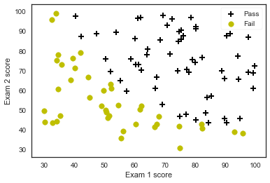
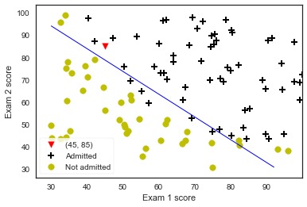
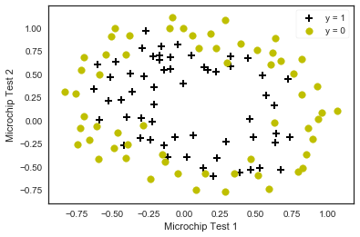
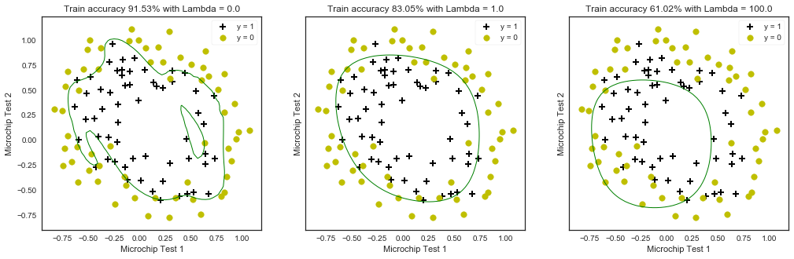

```python
# %load ../../standard_import.txt
import pandas as pd
import numpy as np
import matplotlib as mpl
import matplotlib.pyplot as plt

from scipy.optimize import minimize

from sklearn.preprocessing import PolynomialFeatures

pd.set_option('display.notebook_repr_html', False)
pd.set_option('display.max_columns', None)
pd.set_option('display.max_rows', 150)
pd.set_option('display.max_seq_items', None)
 
#%config InlineBackend.figure_formats = {'pdf',}
%matplotlib inline

import seaborn as sns
sns.set_context('notebook')
sns.set_style('white')
```


```python
def loadData(file, delimiter):
    data = np.loadtxt(file,delimiter=delimiter)
    print('Dimensions: ', data.shape)
    print(data[:6, :])
    return data
```


```python
def plotData(data, label_x, label_y, label_pos, label_neg, axes=None):
    #获得正负样本对应下标
    neg = data[:,2] == 0
    pos = data[:,2] == 1
    
    if axes == None:
        axes = plt.gca()
    axes.scatter(data[pos][:,0], data[pos][:,1], marker='+', c='k', s=60, linewidth=2, label=label_pos)
    axes.scatter(data[neg][:,0], data[neg][:,1], c='y', s=60,label=label_neg)
    axes.set_xlabel(label_x)
    axes.set_ylabel(label_y)
    axes.legend(frameon=True, fancybox=True);
```


```python
data = loadData('data1.txt', ',')
```

    Dimensions:  (100, 3)
    [[ 34.62365962  78.02469282   0.        ]
     [ 30.28671077  43.89499752   0.        ]
     [ 35.84740877  72.90219803   0.        ]
     [ 60.18259939  86.3085521    1.        ]
     [ 79.03273605  75.34437644   1.        ]
     [ 45.08327748  56.31637178   0.        ]]
    


```python
X = np.c_[np.ones((data.shape[0],1)), data[:,0:2]]
X[:5,:]
```


    array([[  1.        ,  34.62365962,  78.02469282],
           [  1.        ,  30.28671077,  43.89499752],
           [  1.        ,  35.84740877,  72.90219803],
           [  1.        ,  60.18259939,  86.3085521 ],
           [  1.        ,  79.03273605,  75.34437644]])


```python
y = np.c_[data[:,2]]
```


```python
plotData(data, 'Exam 1 score', 'Exam 2 score', 'Pass', 'Fail')
```





```python
#sigmoid函数
def sigmoid(z):
    return (1/(1+np.exp(-z)))
```

#### 损失函数
#### $$ J(\theta) = \frac{1}{m}\sum_{i=1}^{m}\big[-y^{(i)}\, log\,( h_\theta\,(x^{(i)}))-(1-y^{(i)})\,log\,(1-h_\theta(x^{(i)}))\big]$$
#### 向量化的损失函数(矩阵形式)
#### $$ J(\theta) = -\frac{1}{m}\big((\,log\,(g(X\theta))^Ty+(\,log\,(1-g(X\theta))^T(1-y)\big)$$


```python
#定义损失函数
def costFunction(theta, X, y):
    m = y.size
    h = sigmoid(X.dot(theta))
    
    J = -1.0*(1.0/m)*(np.log(h).T.dot(y)+np.log(1-h).T.dot(1-y))
    
    if np.isnan(J[0]):
        return(np.inf)
    return J[0]
```

#### 求偏导(梯度)

#### $$ \frac{\partial J(\theta)}{\partial\theta_{j}} = \frac{1}{m}\sum_{i=1}^{m} ( h_\theta (x^{(i)})-y^{(i)})x^{(i)}_{j} $$ 
#### 向量化的偏导(梯度)
#### $$ \frac{\partial J(\theta)}{\partial\theta_{j}} = \frac{1}{m} X^T(g(X\theta)-y)$$


```python
#求解梯度
def gradient(theta, X, y):
    m= y.size
    h = sigmoid(X.dot(theta.reshape(-1,1)))
    
    grad = (1.0/m)*X.T.dot(h-y)
    
    return (grad.flatten())
```


```python
initial_theta = np.zeros(X.shape[1])
cost = costFunction(initial_theta, X, y)
grad = gradient(initial_theta, X, y)
print('Cost: ', cost)
print('Grad: ', grad)
```

    Cost:  0.69314718056
    Grad:  [ -0.1        -12.00921659 -11.26284221]
    

#### 最小化损失函数


```python
res = minimize(costFunction, initial_theta, args=(X,y), jac=gradient, options={'maxiter':1000})
res
```

    d:\program files\python\python35\lib\site-packages\ipykernel_launcher.py:6: RuntimeWarning: divide by zero encountered in log
      
    d:\program files\python\python35\lib\site-packages\ipykernel_launcher.py:6: RuntimeWarning: divide by zero encountered in log
      
    


          fun: 0.2034977015895099
     hess_inv: array([[  2.85339493e+03,  -2.32908823e+01,  -2.27416470e+01],
           [ -2.32908823e+01,   2.04489131e-01,   1.72969525e-01],
           [ -2.27416470e+01,   1.72969525e-01,   1.96170322e-01]])
          jac: array([ -2.68557642e-09,   4.36433473e-07,  -1.39671758e-06])
      message: 'Optimization terminated successfully.'
         nfev: 34
          nit: 25
         njev: 30
       status: 0
      success: True
            x: array([-25.16131634,   0.2062316 ,   0.20147143])


```python
def predict(theta, X,  threshold=0.5):
    p = sigmoid(X.dot(theta.T)) >= threshold
    return(p.astype('int'))
```


```python
sigmoid(np.array([1, 45, 85]).dot(res.x.T))
```


    0.77629032493310179


```python
plt.scatter(45, 85, s=60, c='r', marker='v', label='(45, 85)')
plotData(data, 'Exam 1 score', 'Exam 2 score', 'Admitted', 'Not admitted')
x1_min, x1_max = X[:,1].min(), X[:,1].max(),
x2_min, x2_max = X[:,2].min(), X[:,2].max(),
xx1, xx2 = np.meshgrid(np.linspace(x1_min, x1_max), np.linspace(x2_min, x2_max))
h = sigmoid(np.c_[np.ones((xx1.ravel().shape[0],1)), xx1.ravel(), xx2.ravel()].dot(res.x))
h = h.reshape(xx1.shape)
plt.contour(xx1, xx2, h, [0.5], linewidths=1, colors='b');
```





```python
data2 = loaddata('data2.txt', ',')
```

    Dimensions:  (118, 3)
    [[ 0.051267  0.69956   1.      ]
     [-0.092742  0.68494   1.      ]
     [-0.21371   0.69225   1.      ]
     [-0.375     0.50219   1.      ]
     [-0.51325   0.46564   1.      ]
     [-0.52477   0.2098    1.      ]]
    


```python
# 拿到X和y
y = np.c_[data2[:,2]]
X = data2[:,0:2]
```


```python
# 画个图
plotData(data2, 'Microchip Test 1', 'Microchip Test 2', 'y = 1', 'y = 0')
```





```python
poly = PolynomialFeatures(6)
XX = poly.fit_transform(data2[:,0:2])
# 看看形状(特征映射后x有多少维了)
XX.shape
```


    (118, 28)


#### 正则化后损失函数
#### $$ J(\theta) = \frac{1}{m}\sum_{i=1}^{m}\big[-y^{(i)}\, log\,( h_\theta\,(x^{(i)}))-(1-y^{(i)})\,log\,(1-h_\theta(x^{(i)}))\big] + \frac{\lambda}{2m}\sum_{j=1}^{n}\theta_{j}^{2}$$
#### 向量化的损失函数(矩阵形式)
#### $$ J(\theta) = -\frac{1}{m}\big((\,log\,(g(X\theta))^Ty+(\,log\,(1-g(X\theta))^T(1-y)\big) + \frac{\lambda}{2m}\sum_{j=1}^{n}\theta_{j}^{2}$$


```python
# 定义损失函数
def costFunctionReg(theta, reg, *args):
    m = y.size
    h = sigmoid(XX.dot(theta))
    
    J = -1.0*(1.0/m)*(np.log(h).T.dot(y)+np.log(1-h).T.dot(1-y)) + (reg/(2.0*m))*np.sum(np.square(theta[1:]))
    
    if np.isnan(J[0]):
        return(np.inf)
    return(J[0])
```

#### 偏导(梯度)

#### $$ \frac{\delta J(\theta)}{\delta\theta_{j}} = \frac{1}{m}\sum_{i=1}^{m} ( h_\theta (x^{(i)})-y^{(i)})x^{(i)}_{j} + \frac{\lambda}{m}\theta_{j}$$ 
#### 向量化的偏导(梯度)
#### $$ \frac{\delta J(\theta)}{\delta\theta_{j}} = \frac{1}{m} X^T(g(X\theta)-y) + \frac{\lambda}{m}\theta_{j}$$


```python
def gradientReg(theta, reg, *args):
    m = y.size
    h = sigmoid(XX.dot(theta.reshape(-1,1)))
      
    grad = (1.0/m)*XX.T.dot(h-y) + (reg/m)*np.r_[[[0]],theta[1:].reshape(-1,1)]
        
    return(grad.flatten())
```


```python
initial_theta = np.zeros(XX.shape[1])
costFunctionReg(initial_theta, 1, XX, y)
```


    0.69314718055994529


```python
fig, axes = plt.subplots(1,3, sharey = True, figsize=(17,5))

# 决策边界，咱们分别来看看正则化系数lambda太大太小分别会出现什么情况
# Lambda = 0 : 就是没有正则化，这样的话，就过拟合咯
# Lambda = 1 : 这才是正确的打开方式
# Lambda = 100 : 卧槽，正则化项太激进，导致基本就没拟合出决策边界

for i, C in enumerate([0.0, 1.0, 100.0]):
    # 最优化 costFunctionReg
    res2 = minimize(costFunctionReg, initial_theta, args=(C, XX, y), jac=gradientReg, options={'maxiter':3000})
    
    # 准确率
    accuracy = 100.0*sum(predict(res2.x, XX) == y.ravel())/y.size    

    # 对X,y的散列绘图
    plotData(data2, 'Microchip Test 1', 'Microchip Test 2', 'y = 1', 'y = 0', axes.flatten()[i])
    
    # 画出决策边界
    x1_min, x1_max = X[:,0].min(), X[:,0].max(),
    x2_min, x2_max = X[:,1].min(), X[:,1].max(),
    xx1, xx2 = np.meshgrid(np.linspace(x1_min, x1_max), np.linspace(x2_min, x2_max))
    h = sigmoid(poly.fit_transform(np.c_[xx1.ravel(), xx2.ravel()]).dot(res2.x))
    h = h.reshape(xx1.shape)
    axes.flatten()[i].contour(xx1, xx2, h, [0.5], linewidths=1, colors='g');       
    axes.flatten()[i].set_title('Train accuracy {}% with Lambda = {}'.format(np.round(accuracy, decimals=2), C))
```

    d:\program files\python\python35\lib\site-packages\ipykernel_launcher.py:3: RuntimeWarning: overflow encountered in exp
      This is separate from the ipykernel package so we can avoid doing imports until
    





```python

```
